# 1. Create a CDH Cluster on AWS

## Prepare ( ALL Node)

1. yum update
<pre><code>
$ sudo yum update
$ sudo yum install -y wget
</code></pre>

2. firewall check and disable
<pre><code>
$ systemctl status firewalld
</code></pre>


해당 시스템은 firewalld 없음 필요시
<pre><code>
$ systemctl stop firewalld
$ systemctl disable firewalld
</code></pre>

3. Selinux 정지
<pre><code>
[centos@cm ~]$ sestatus
SELinux status:                 disabled
[centos@cm ~]$ sudo vi /etc/selinux/config
</code></pre>

4. NTP 설정
<pre><code>
[centos@cm ~]$ sudo yum install -y ntp
[centos@cm ~]$ sudo vi /etc/ntp.conf
[centos@cm ~]$ systemctl start ntpd
[centos@cm ~]$ systemctl enable ntpd
[centos@cm ~]$ ntpq -p
</code></pre>

5. VM Swappiness 설정
<pre><code>
[centos@ip-172-31-9-97 ~]$ sudo sysctl vm.swappiness=1
vm.swappiness = 1
</code></pre>

VM Swappiness permanent
<pre><code>
sudo vi /etc/sysctl.conf
  =>  vm.swappiness=1
</code></pre>

6. SSH Connetion 설정
<pre><code>

</code></pre>

7. Disable Transparent Hugepage Support
<pre><code>
sudo vi /etc/rc.d/rc.local
  =>  
echo "never" > /sys/kernel/mm/transparent_hugepage/enabled
echo "never" > /sys/kernel/mm/transparent_hugepage/defrag
sudo chmod +x /etc/rc.d/rc.local
sudo vi /etc/default/grub
   add -> transparent_hugepage=never (on line GRUB_CMDLINE_LINUX )
grub2-mkconfig -o /boot/grub2/grub.cfg
</code></pre>

8. 필요시 IP V6 disable
<pre><code>
sudo sysctl -w net.ipv6.conf.all.disable_ipv6=1
sudo sysctl -w net.ipv6.conf.default.disable_ipv6=1
</code></pre>

# Linux Setup

## ADD Account
- 3800 UID 로 training 계정 생성, 암호 설정, skcc 그룹 생성
- sudo 권한 부여
<pre><code>
[centos@ip-172-31-39-152 ~]$ sudo groupadd skcc
[centos@ip-172-31-39-152 ~]$ sudo useradd training -u 3800 -g skcc
[centos@ip-172-31-39-152 ~]$ more /etc/passwd | grep skcc
skcc:x:3800:1001::/home/skcc:/bin/bash
[centos@ip-172-31-39-152 ~]$ sudo visudo
</code></pre>
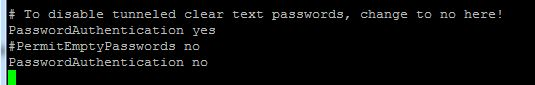

## IP address and DNS
<pre><code>
[centos@cm ~]$ getent hosts
</code></pre>
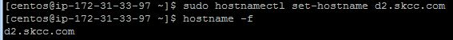
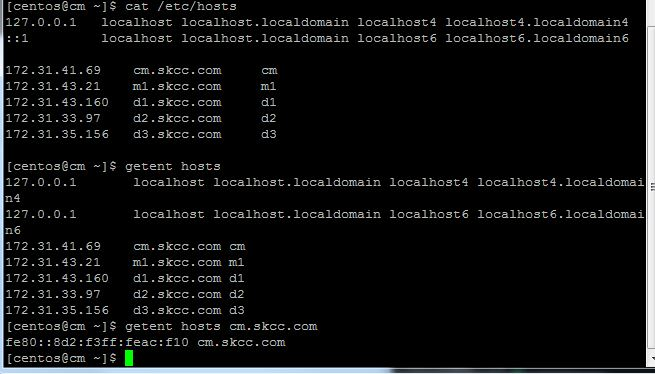

## List the Linux release
<br>
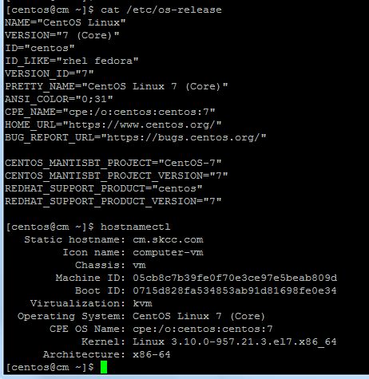

## List the file system capacity
<br>
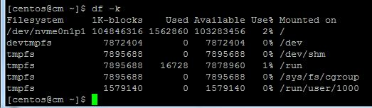

## yum repolist enabled
<br>
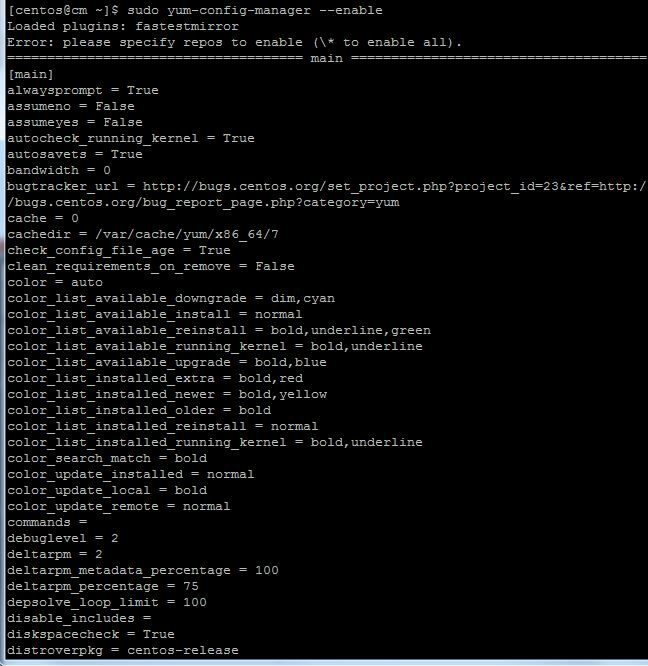

## List the /etc/passwd entries for training
<br>
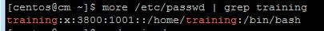

## List the /etc/group entries for skcc
<br>
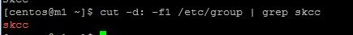

## getent group skcc 와 getent passwd training
<br>
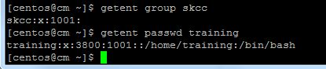


# Install a MariaDB server
<br>
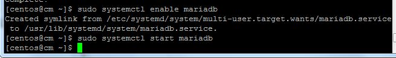

## shows the hostname
<br>
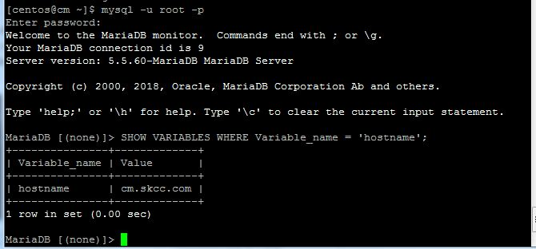

## reports the database server version
<br>
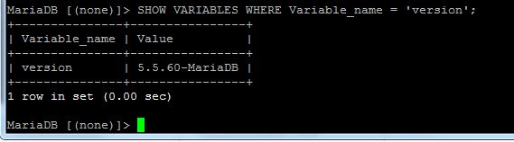

## lists all the databases
<br>
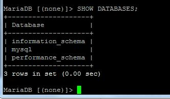

# Install Cloudera Manager

## install CDH version 5.15.2
<br>

## Import Cloudera manager repository 
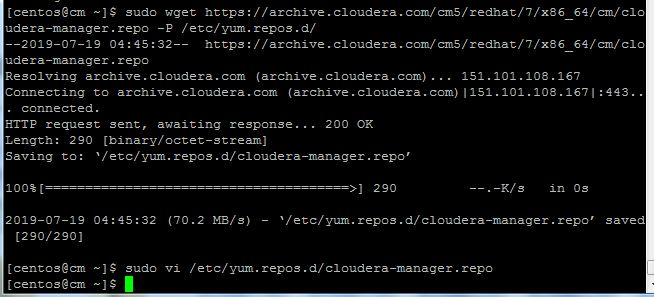
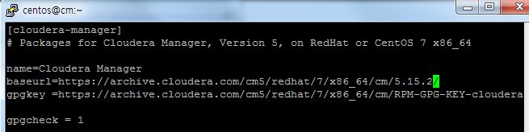

## mysql-connector setting
```
sudo wget https://dev.mysql.com/get/Downloads/Connector-J/mysql-connector-java-5.1.46.tar.gz ~/
tar xvfz ~/mysql-connector-java-5.1.46.tar.gz
sudo mkdir -p /usr/share/java
sudo cp ~/mysql-connector-java-5.1.46/mysql-connector-java-5.1.46-bin.jar /usr/share/java/mysql-connector-java.jar
```

## Copy to all other nodes
```
scp /usr/share/java/mysql-connector-java.jar m1:~/
scp /usr/share/java/mysql-connector-java.jar d1:~/
scp /usr/share/java/mysql-connector-java.jar d2:~/
scp /usr/share/java/mysql-connector-java.jar d3:~/

ssh m1 "sudo mkdir -p /usr/share/java; sudo mv ~/mysql-connector-java.jar /usr/share/java/"
ssh d1 "sudo mkdir -p /usr/share/java; sudo mv ~/mysql-connector-java.jar /usr/share/java/"
ssh d2 "sudo mkdir -p /usr/share/java; sudo mv ~/mysql-connector-java.jar /usr/share/java/"
ssh d3 "sudo mkdir -p /usr/share/java; sudo mv ~/mysql-connector-java.jar /usr/share/java/"
```
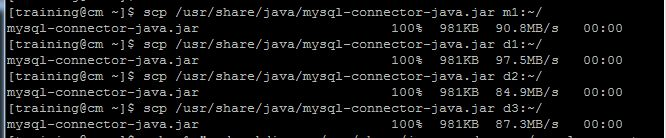

## 보안설정
```
sudo /usr/bin/mysql_secure_installation
```
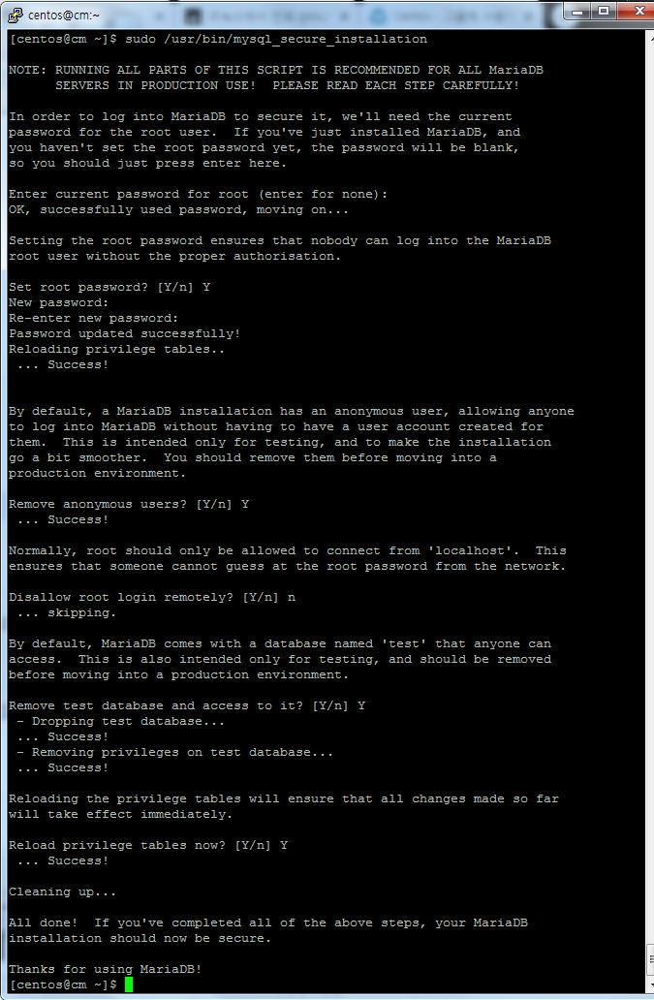

## Create Databases and users for Cloudera manager and eco systems
```
CREATE DATABASE scm DEFAULT CHARACTER SET utf8 DEFAULT COLLATE utf8_general_ci; GRANT ALL ON scm.* TO 'scm'@'%' IDENTIFIED BY 'training';
CREATE DATABASE amon DEFAULT CHARACTER SET utf8 DEFAULT COLLATE utf8_general_ci; GRANT ALL ON amon.* TO 'amon'@'%' IDENTIFIED BY 'training';
CREATE DATABASE rmon DEFAULT CHARACTER SET utf8 DEFAULT COLLATE utf8_general_ci; GRANT ALL ON rmon.* TO 'rmon'@'%' IDENTIFIED BY 'training';
CREATE DATABASE hue DEFAULT CHARACTER SET utf8 DEFAULT COLLATE utf8_general_ci; GRANT ALL ON hue.* TO 'hue'@'%' IDENTIFIED BY 'training';
CREATE DATABASE metastore DEFAULT CHARACTER SET utf8 DEFAULT COLLATE utf8_general_ci; GRANT ALL ON metastore.* TO 'metastore'@'%' IDENTIFIED BY 'training';
CREATE DATABASE sentry DEFAULT CHARACTER SET utf8 DEFAULT COLLATE utf8_general_ci; GRANT ALL ON sentry.* TO 'sentry'@'%' IDENTIFIED BY 'training';
CREATE DATABASE oozie DEFAULT CHARACTER SET utf8 DEFAULT COLLATE utf8_general_ci; GRANT ALL ON oozie.* TO 'oozie'@'%' IDENTIFIED BY 'training';
FLUSH PRIVILEGES;
EXIT;
>
SHOW DATABASES;
```

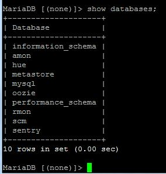

## Configure Cloudera Manager to connect to the database
- install cloudera-manager-daemons cloudera-manager-server
```
sudo yum install -y cloudera-manager-daemons cloudera-manager-server
```

- Run initialize script for SCM
```
sudo /usr/share/cmf/schema/scm_prepare_database.sh mysql scm scm training

```

- Start your Cloudera Manager server
```
sudo systemctl start cloudera-scm-server

sudo tail -f /var/log/cloudera-scm-server/cloudera-scm-server.log
```

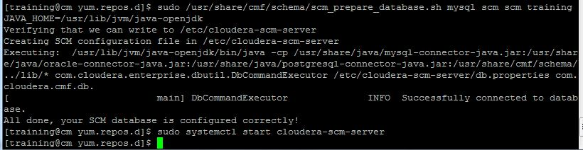

# Cloudera Manager WEB UI (install services)
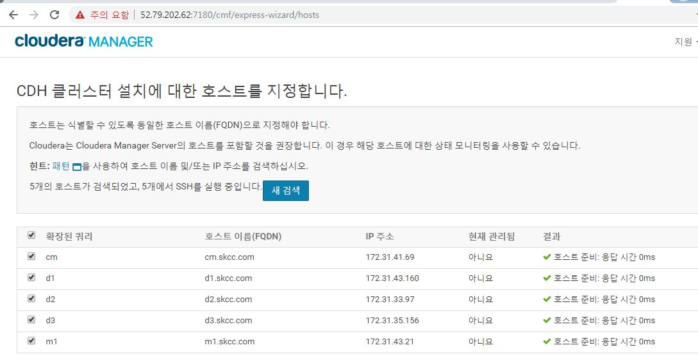
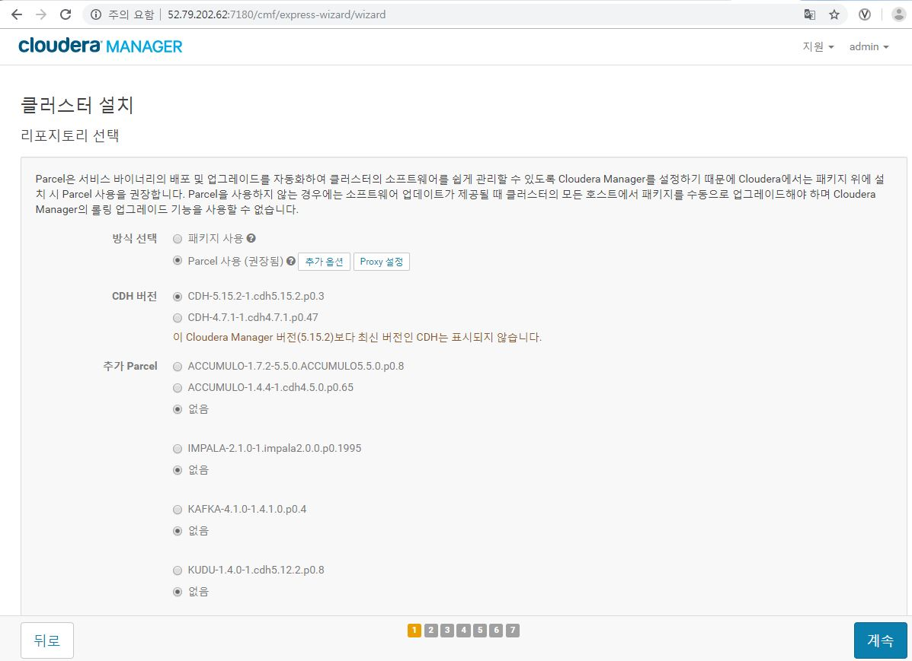
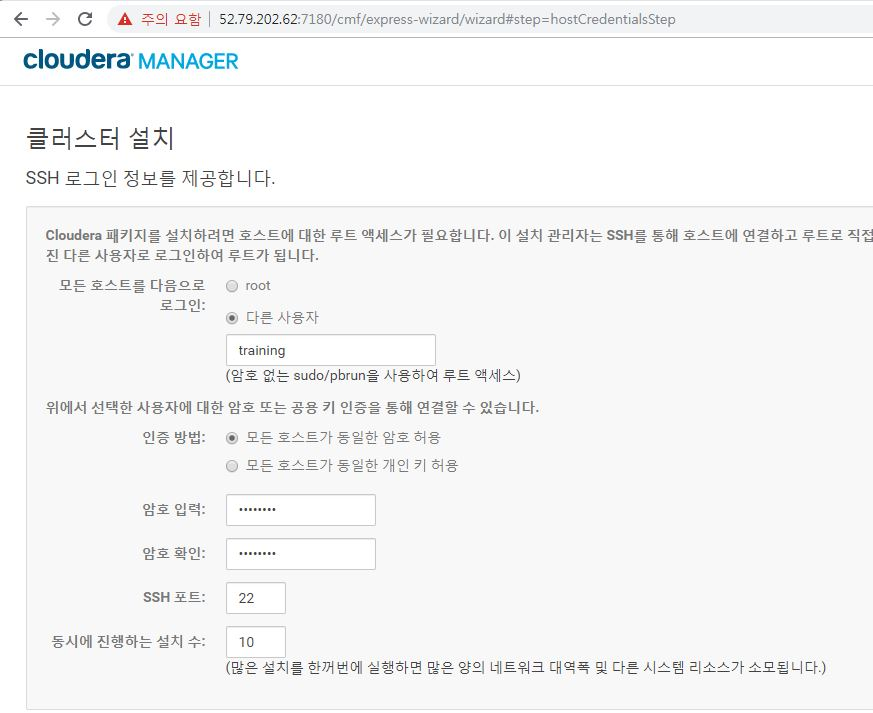
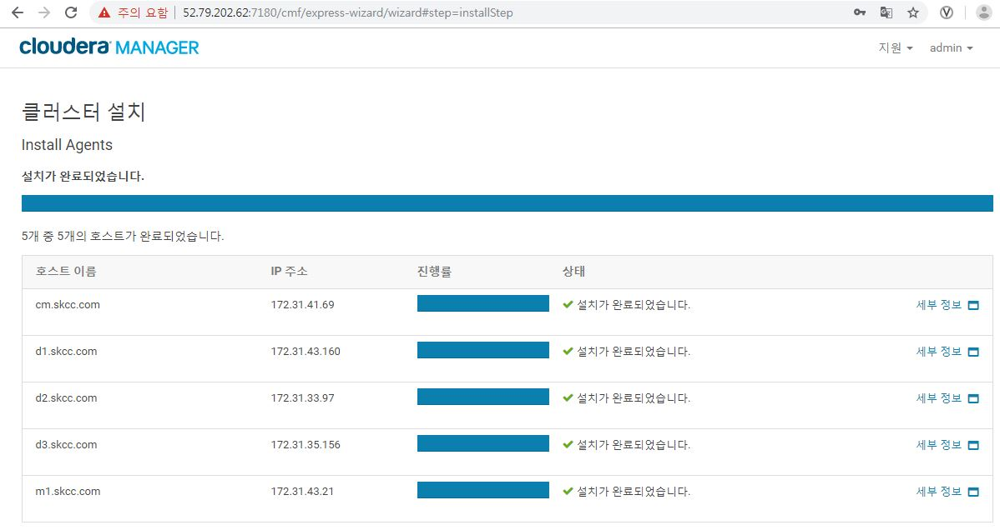
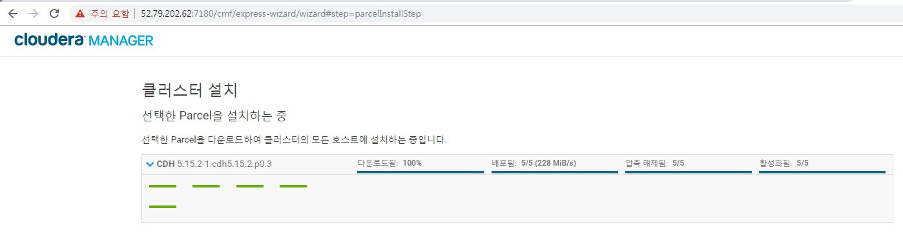
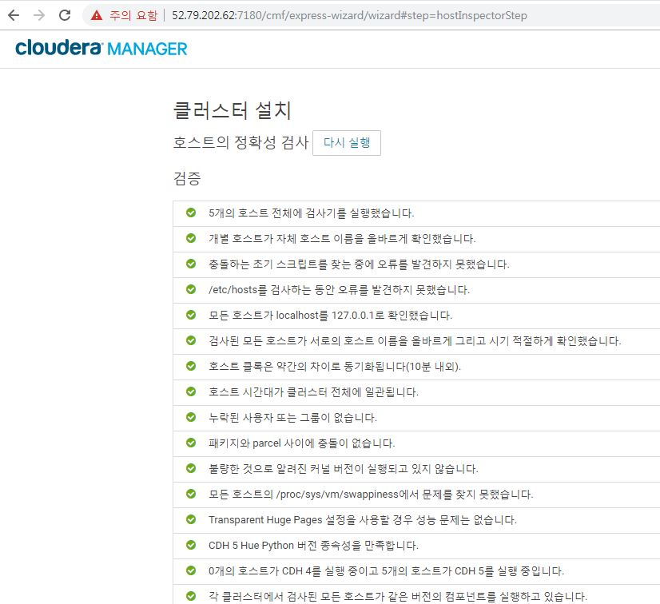
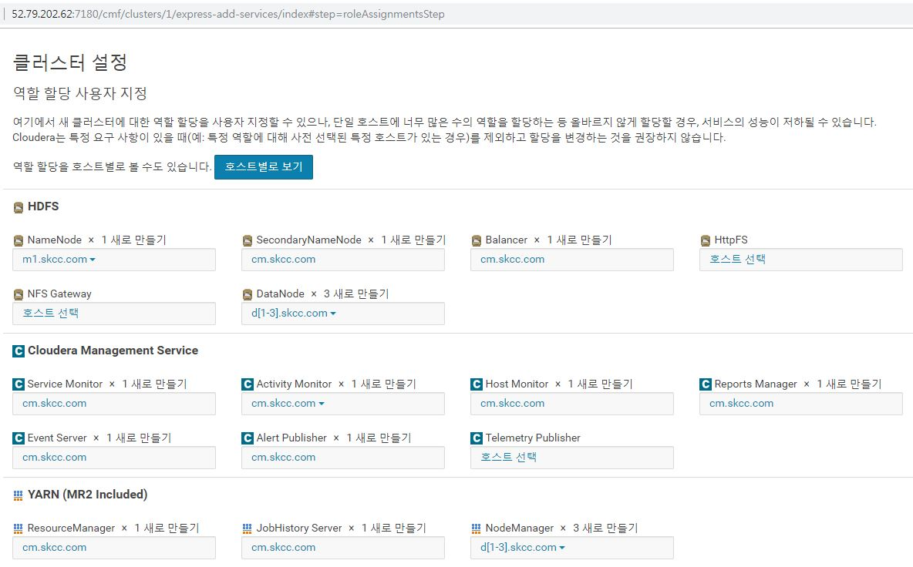
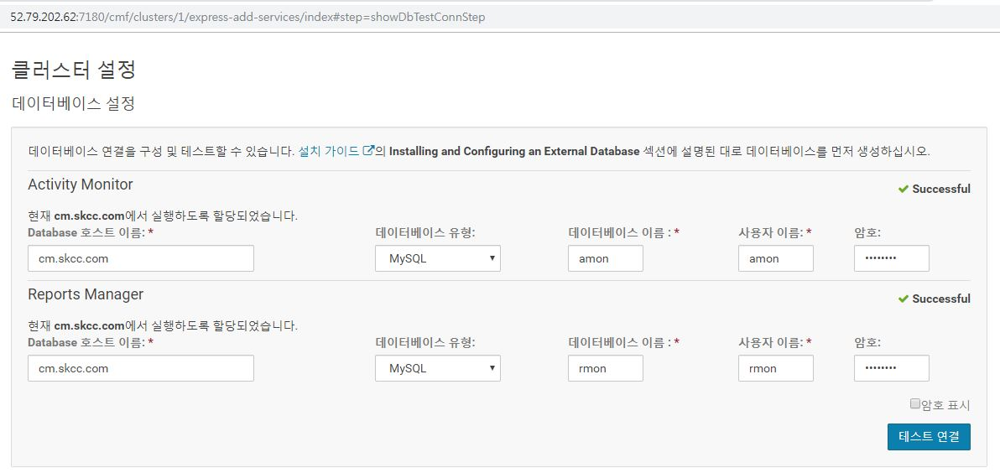
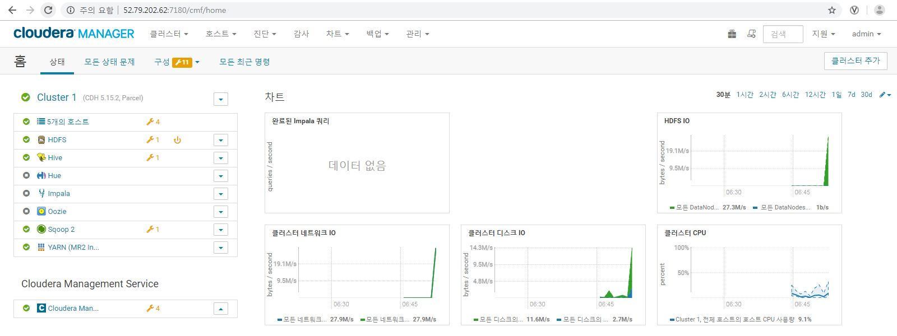
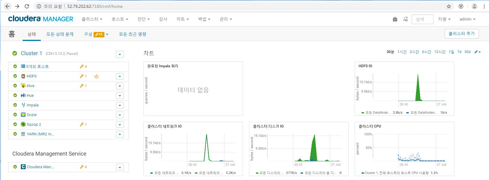
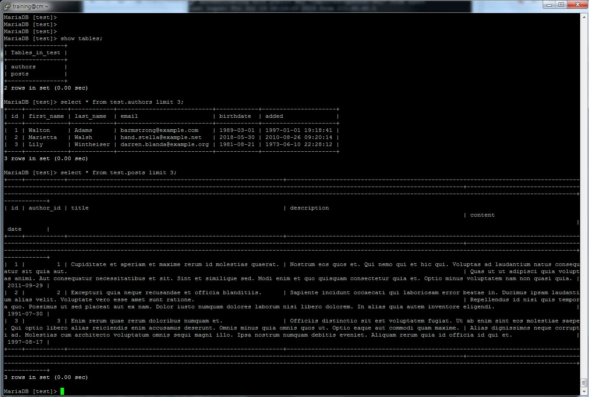


## 2. In MySQL create the sample tables that will be used for the rest of the test
```
sqoop import --connect jdbc:mysql://localhost/test  \
 --username training                                \
 --password training                                \
 --table authors                                    \
 --driver com.mysql.jdbc.Driver                     \
 --target-dir /user/training/                       \
 --hive-import                                      \
 --hive-table authors
```

