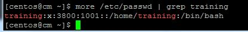
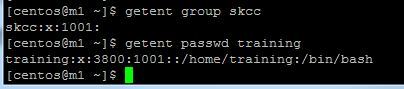
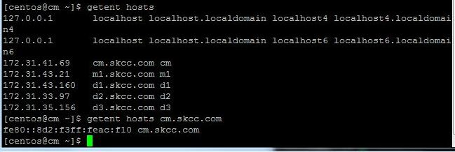
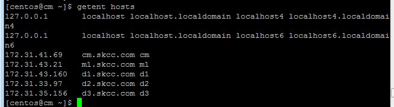
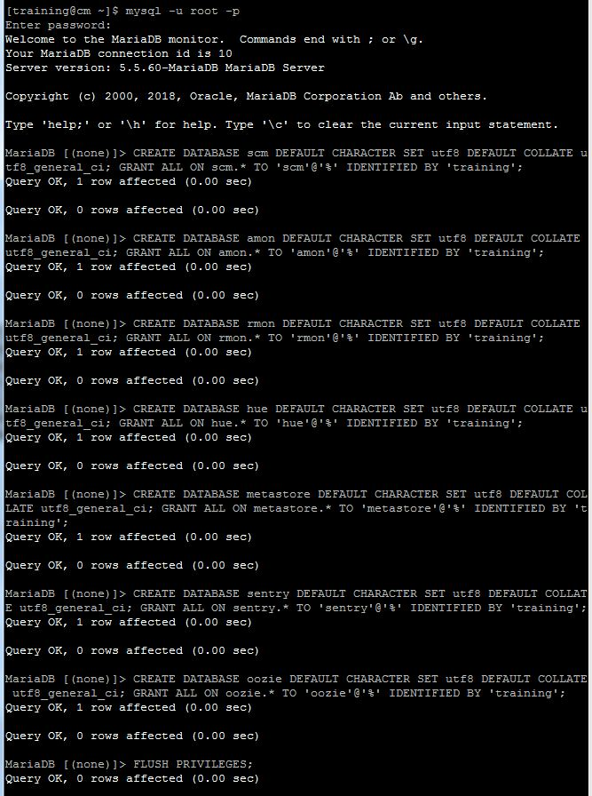

# 1. Create a CDH Cluster on AWS

## Prepare ( ALL Node)

1. yum update
<pre><code>
$ sudo yum update
$ sudo yum install -y wget
</code></pre>

2. firewall check and disable
<pre><code>
$ systemctl status firewalld
</code></pre>


해당 시스템은 firewalld 없음 필요시
<pre><code>
$ systemctl stop firewalld
$ systemctl disable firewalld
</code></pre>

3. Selinux 정지
<pre><code>
[centos@cm ~]$ sestatus
SELinux status:                 disabled
[centos@cm ~]$ sudo vi /etc/selinux/config
</code></pre>

4. NTP 설정
<pre><code>
[centos@cm ~]$ sudo yum install -y ntp
[centos@cm ~]$ sudo vi /etc/ntp.conf
[centos@cm ~]$ systemctl start ntpd
[centos@cm ~]$ systemctl enable ntpd
[centos@cm ~]$ ntpq -p
</code></pre>

5. VM Swappiness 설정
<pre><code>
[centos@ip-172-31-9-97 ~]$ sudo sysctl vm.swappiness=1
vm.swappiness = 1
</code></pre>

VM Swappiness permanent
<pre><code>
sudo vi /etc/sysctl.conf
  =>  vm.swappiness=1
</code></pre>

6. SSH Connetion 설정
<pre><code>

</code></pre>

7. Disable Transparent Hugepage Support
<pre><code>
sudo vi /etc/rc.d/rc.local
  =>  
echo "never" > /sys/kernel/mm/transparent_hugepage/enabled
echo "never" > /sys/kernel/mm/transparent_hugepage/defrag
sudo chmod +x /etc/rc.d/rc.local
sudo vi /etc/default/grub
   add -> transparent_hugepage=never (on line GRUB_CMDLINE_LINUX )
grub2-mkconfig -o /boot/grub2/grub.cfg
</code></pre>

8. 필요시 IP V6 disable
<pre><code>
sudo sysctl -w net.ipv6.conf.all.disable_ipv6=1
sudo sysctl -w net.ipv6.conf.default.disable_ipv6=1
</code></pre>

# Linux Setup

## ADD Account
- 3800 UID 로 training 계정 생성, 암호 설정, skcc 그룹 생성
- sudo 권한 부여
<pre><code>
[centos@ip-172-31-39-152 ~]$ sudo groupadd skcc
[centos@ip-172-31-39-152 ~]$ sudo useradd training -u 3800 -g skcc
[centos@ip-172-31-39-152 ~]$ more /etc/passwd | grep skcc
skcc:x:3800:1001::/home/skcc:/bin/bash
[centos@ip-172-31-39-152 ~]$ sudo visudo
</code></pre>




## IP address and DNS
<pre><code>
[centos@cm ~]$ getent hosts
</code></pre>



## List the Linux release
<br>


## List the file system capacity
<br>


## yum repolist enabled
<br>


## List the /etc/passwd entries for training
<br>


## List the /etc/group entries for skcc
<br>


## getent group skcc 와 getent passwd training
<br>


##
<br>


##
<br>


##
<br>


##
<br>


##
<br>


##
<br>


##
<br>


##
<br>








<pre><code>

</code></pre>


<pre><code>

</code></pre>


<pre><code>

</code></pre>


<pre><code>

</code></pre>


<pre><code>

</code></pre>


<pre><code>

</code></pre>


<pre><code>

</code></pre>


<pre><code>

</code></pre>


<pre><code>

## 2. In MySQL create the sample tables that will be used for the rest of the test
```
sqoop import --connect jdbc:mysql://localhost/test  \
 --username training                                \
 --password training                                \
 --table authors                                    \
 --driver com.mysql.jdbc.Driver                     \
 --target-dir /user/training/                       \
 --hive-import                                      \
 --hive-table authors
```

