# Part2 - Big Data Knowledge Test

## Problem 1

```
SELECT A.id,
       A.type,
       A.status,
       A.amount,
       (A.amount-B.avg_amt) AS difference
  FROM account A
  JOIN ( SELECT type ,
                AVG(amount) AS avg_amt
           FROM problem1.account
          GROUP BY type
       ) B
    ON A.type = B.type
 WHERE A.status='Active'
```
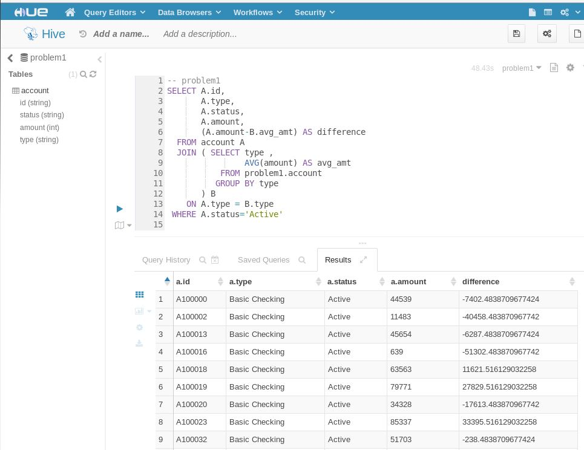

## Problem 2

```
CREATE DATABASE problem2;
CREATE EXTERNAL TABLE solution
(
    id INT,
    fname STRING,
    lname STRING,
    address STRING,
    city STRING,
    state STRING,
    zip STRING,
    birthday STRING,
    hireday STRING
)
    STORED AS PARQUET
    LOCATION '/user/training/problem2/data/employee'
SELECT * FROM solution;
```
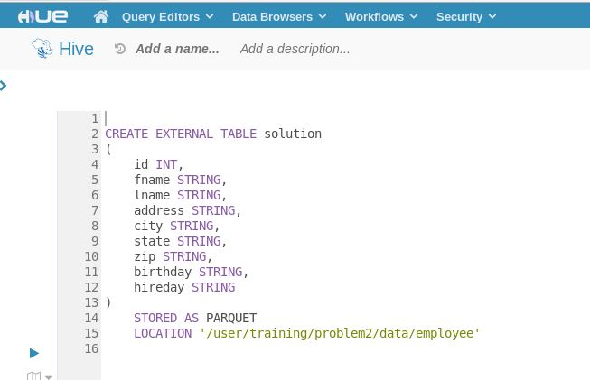

## Problem 3

```
CREATE TABLE solution AS
SELECT C.id, C.fname, C.lname, C.hphone
  FROM problem3.CUSTOMER C
  JOIN problem3.ACCOUNT A
    ON C.id = A.custid
 WHERE A.amount < 0;
```
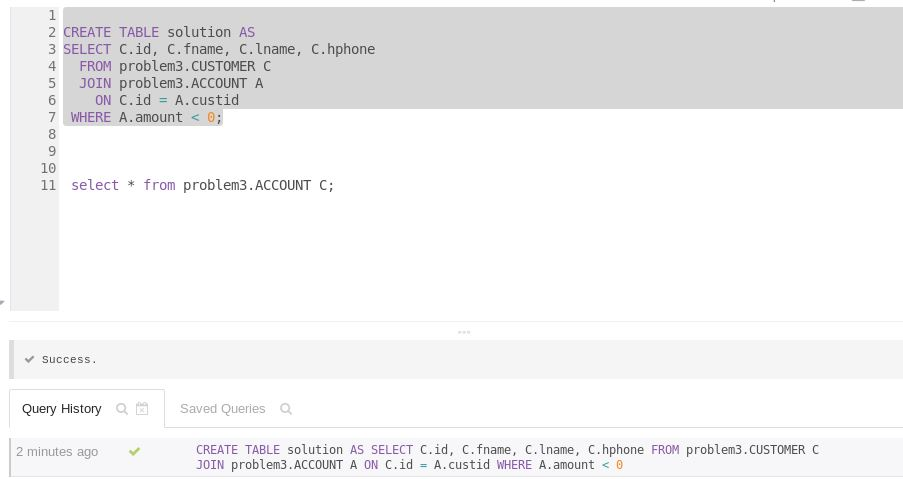

## Problem 4

```

```

## Problem 5

```
SELECT A.fname, A.lname, A.city, A.state
  FROM problem5.customer A
 WHERE A.city = 'Palo Alto'
   AND A.state = 'CA'
 UNION ALL
SELECT B.fname, B.lname, B.city, B.state
  FROM problem5.employee B
 WHERE B.city = 'Palo Alto'
   AND B.state = 'CA'
```
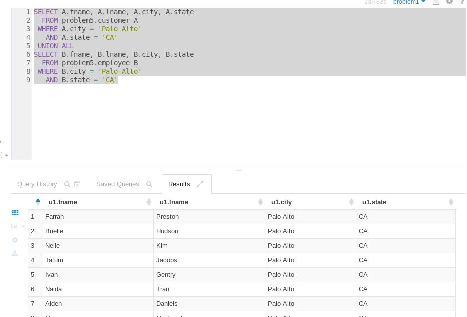

## problem 6

```

use problem6;

CREATE TABLE problem6.solution
(
	  id INT,
	  fname STRING,
	  lname STRING,
	  address STRING,
	  city STRING,
	  state STRING,
	  zip STRING,
	  birthday STRING
);

INSERT INTO TABLE problem6.solution
SELECT id, fname, lname, address, city, state, zip, substring(birthday, 0 ,5)
  FROM problem6.employee;
  
SELECT * FROM problem6.solution;
```
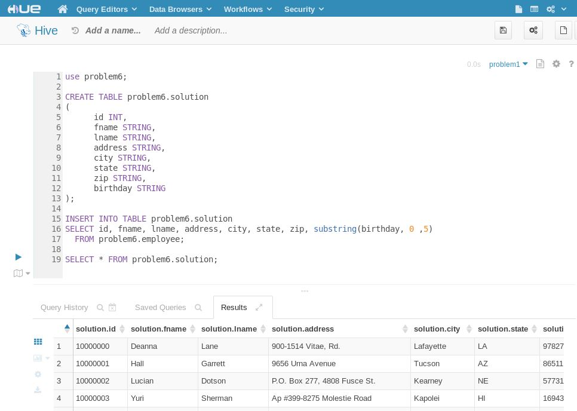

## problem 7

```
SELECT CONCAT(fname, ',' , lname) AS name
  FROM problem7.employee
 WHERE city = 'Seattle'
 ORDER BY name
```
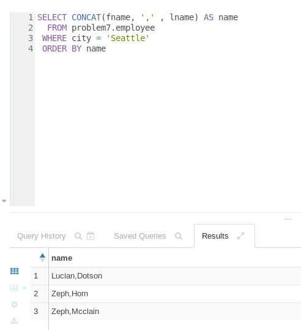

## problem 8

```
sqoop export --connect jdbc:mysql://localhost/problem8    \
      --username cloudera                                 \
      --password cloudera                                 \
      --export-dir /user/training/problem8/data/customer  \
      --table solution                                    \
      --input-fields-terminated-by '\t'
```
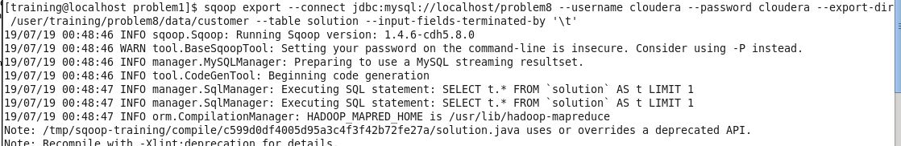
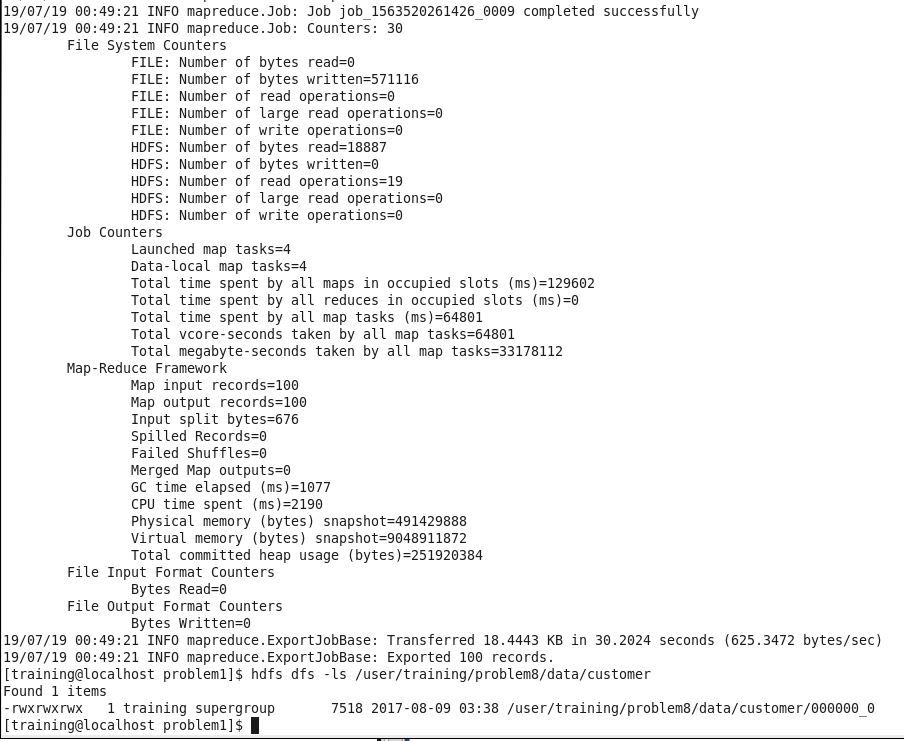

## problem 9

```
CREATE TABLE problem9.solution
(
	  id STRING,
	  fname STRING,
	  lname STRING,
	  address STRING,
	  city STRING,
	  state STRING,
	  zip STRING,
	  birthday STRING
);

INSERT INTO TABLE problem9.solution;

SELECT CONCAT('A', id),
	     fname,
	     lname,
	     address,
	     city,
	     state,
	     zip,
	     birthday
  FROM problem9.customer;
SELECT * FROM problem9.solution;
```
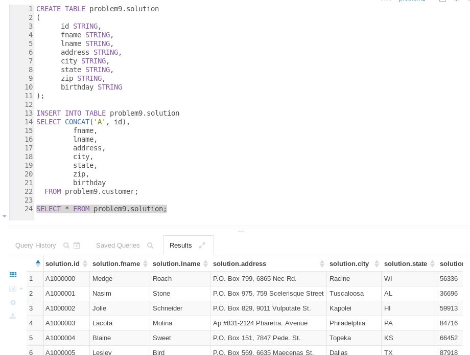

## problem 10

```
CREATE VIEW problem10.solution AS
SELECT A.id,
       A.fname,
       A.lname,
       A.city,
       A.state,
       B.charge,
       substr(B.tstamp,1,10) AS billdata
  FROM problem10.customer A
  JOIN problem10.billing B
    ON A.id = B.id;
    
select * from problem10.solution;	
	
```
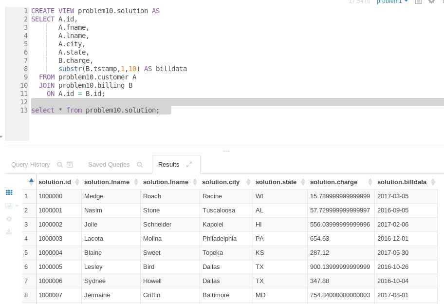

## BONUS QUESTION:

### a. 답

```
SELECT A.brand,
       A.name,
       COUNT(A.prod_id) AS cnt
  FROM products A
  JOIN order_details B
    ON (A.prod_id = B.prod_id)
 WHERE A.brand = 'Dualcore'
 GROUP BY brand, name, A.prod_id
 ORDER BY cnt DESC
 LIMIT 3;
```


### b. 답

```
SELECT TO_DATE(order_date) as date,
       SUM(price) AS revenue,
       SUM(price - cost) as profit
  FROM products A
  JOIN order_details B
    ON (A.prod_id = B.prod_id)
  JOIN orders C
    ON (B.order_id = C.order_id)
 WHERE A.brand = 'Dualcore'
 GROUP BY TO_DATE(order_date)
 ORDER BY date;
```
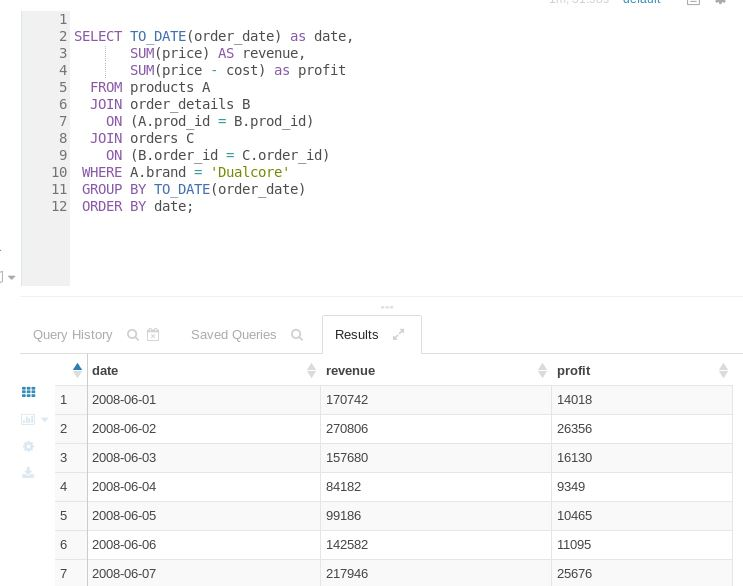

### c. 답

```
SELECT A.order_id,
       SUM(B.price) AS total
  FROM order_details A
  JOIN products B
    ON (A.prod_id = B.prod_id)
  GROUP BY order_id
  ORDER BY total DESC
  LIMIT 10;
```
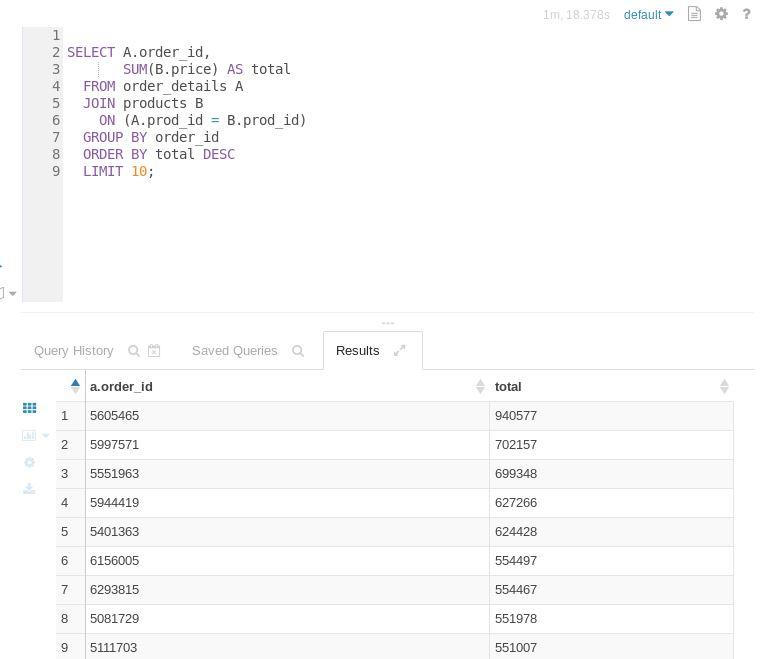
